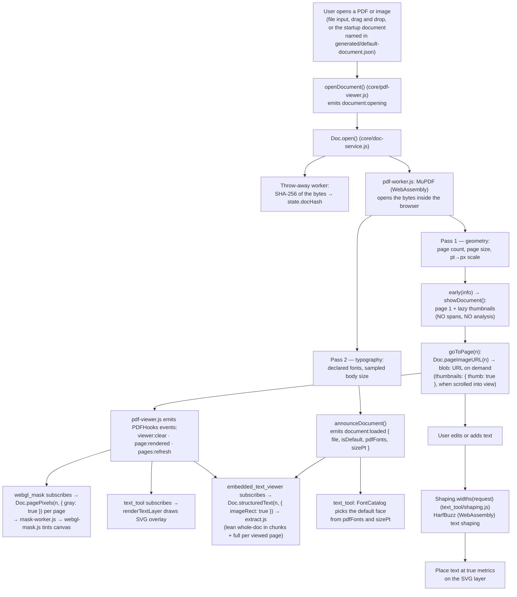
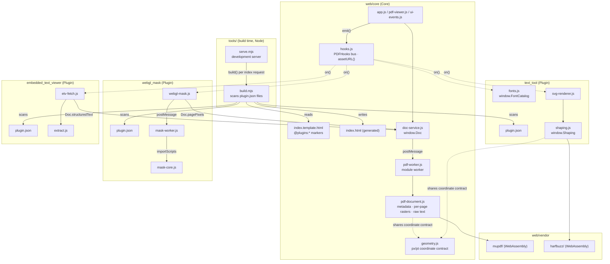

# Recto — Architecture Overview

Recto is an extensible PDF editor that runs entirely in the browser. It opens a PDF or
scanned image, renders its pages, and lets you edit and add text with true font metrics — and
everything beyond that is a plugin.

The site is static: a folder of files (`web/`) that any file host can serve. There is no
server-side code, no endpoint and no database. MuPDF and HarfBuzz run as WebAssembly, the
document is parsed in a worker, and **the file the user opens never leaves the browser**.

The project uses a "Core + Plugin" architecture with two complementary mechanisms — a
**plugin manifest** (`plugin.json`, scanned by `tools/build.mjs`) for page wiring and a
**JavaScript hook bus** (`PDFHooks`) for run-time lifecycle wiring — so features live in
independent, individually-removable folders.

The dividing line is strict: **the core opens the document and runs no analysis.** It shows
pages, reports the document's typography, hands out raw primitives (page pixels, structured
text) through the `Doc` service, then emits `document:loaded`. Any plugin that wants to draw a
conclusion about the document listens for that event and does its own work on those
primitives. `webgl_mask` — which finds the blacked-out regions of a page and tints them on the
GPU — is a plugin like any other, and deleting its folder leaves the core untouched.

## Technology Stack

| Layer | Technology | Purpose |
|-------|-----------|---------|
| **Hosting** | Any static file host | Serves `web/` as plain files; nothing runs on the host |
| **PDF parsing and rasters** | MuPDF 1.28.0 as WebAssembly (`web/vendor/mupdf/`), inside a module worker | Open the document, hand out page rasters, structured text, image placement |
| **Text shaping** | HarfBuzz 14.4.0 as WebAssembly (harfbuzzjs 1.6.1, `web/vendor/harfbuzz/`) | Measure precise pixel widths of text, kerning included (`text_tool`) |
| **Mask detection** | Plain JavaScript in a worker (`web/plugins/webgl_mask/mask-core.js`) | Detect black rectangular regions in a page's pixels and build a gray mask |
| **Frontend rendering** | Vanilla JS, SVG, WebGL | Page display, SVG text overlays, GPU-accelerated mask tinting |
| **Plugin integration** | `plugin.json` manifests + `PDFHooks` event bus | Decoupled wiring: the page is assembled from manifests, the lifecycle runs by event |
| **Build and development** | Node, zero dependencies: `tools/build.mjs`, `tools/serve.mjs` | Scan the plugins into `web/index.html`; serve `web/` locally |
| **Tests** | `node:test` suites against recorded goldens, plus a browser smoke test | Hold every computation to reference outputs (`tests/`) |

There is no bundler, no transpiler and no package manager at run time. The scripts are
classic scripts loaded in a fixed order; the two ES modules (`pdf-worker.js`,
`pdf-document.js`) are loaded by the worker.

## Directory Structure

```
recto/
├── web/                            # Everything the static site serves
│   ├── index.html                  # GENERATED by tools/build.mjs — never edited by hand
│   │
│   ├── core/                       # The core (document opening + base viewer)
│   │   ├── index.template.html     # The page, with @plugins:* markers the build fills in
│   │   ├── hooks.js                # PDFHooks event bus + assetURL() — loaded first
│   │   ├── geometry.js             # The px/pt coordinate contract (window.GEO)
│   │   ├── state.js                # Core-only state and DOM refs (state, els)
│   │   ├── doc-service.js          # window.Doc — the ONLY file that talks to the worker
│   │   ├── pdf-worker.js           # Module worker: owns MuPDF and the open PDF
│   │   ├── pdf-document.js         # ES module: metadata, page rasters, raw structured text
│   │   ├── pdf-viewer.js           # openDocument / showDocument / goToPage
│   │   ├── ui-events.js            # Zoom, thumbnails
│   │   ├── app.js                  # Toolbar wiring, subtoolbar switch, startup document
│   │   ├── styles.css
│   │   └── favicon.ico
│   │
│   ├── plugins/                    # One self-contained folder per plugin
│   │   ├── text_tool/              # Plugin (font logic & typography)
│   │   │   ├── plugin.json         # The manifest: slots, scripts, styles, order
│   │   │   ├── toolbar_button.html # Fragments the build inlines into the page
│   │   │   ├── options_bar.html
│   │   │   ├── shaping.js          # HarfBuzz width measurement (window.Shaping)
│   │   │   ├── fonts.js            # Font catalogue → @font-face + font menu (window.FontCatalog)
│   │   │   ├── unified-text-box.js, svg-renderer.js, toolbar.js, …
│   │   │   └── styles.css
│   │   │
│   │   ├── webgl_mask/             # Plugin (visual GPU masks)
│   │   │   ├── plugin.json
│   │   │   ├── toolbar_button.html, options_bar.html
│   │   │   ├── webgl-mask.js       # WebGL renderer + lifecycle wiring
│   │   │   ├── mask-worker.js      # The plugin's own worker
│   │   │   ├── mask-core.js        # Mask detection, pure loops (MaskCore)
│   │   │   └── webgl-mask.css
│   │   │
│   │   └── embedded_text_viewer/   # Plugin (inline overlay of the PDF's embedded text)
│   │       ├── plugin.json
│   │       ├── toolbar_button.html
│   │       ├── extract.js          # Raw structured text → spans in image px (EtvExtract)
│   │       ├── etv-fetch.js        # Chunked extraction & lifecycle (subscribes to PDFHooks)
│   │       └── styles.css
│   │
│   ├── vendor/                     # Pinned third-party builds, copied in verbatim
│   │   ├── mupdf/                  # MuPDF 1.28.0 (AGPL-3.0)
│   │   ├── harfbuzz/               # harfbuzzjs 1.6.1 = HarfBuzz 14.4.0 (MIT)
│   │   └── README.md               # Versions, sources, upgrade and caching notes
│   │
│   ├── assets/
│   │   ├── fonts/                  # fonts.json (the catalogue) + the face files it names
│   │   └── pdfs/                   # Startup document — the PDF here auto-loads on open
│   │
│   └── generated/                  # GENERATED by tools/build.mjs
│       ├── plugins.json            # The plugins found, in load order
│       ├── fonts.json              # The catalogue + which face files exist + their hashes
│       └── default-document.json   # The startup document, or { "file": null }
│
├── tools/
│   ├── build.mjs                   # The scan: plugin.json files → web/index.html + web/generated/*
│   ├── serve.mjs                   # Development server: static files, .wasm MIME type, COOP/COEP
│   └── dev/                        # Standalone maintenance scripts (fonts_setup.py rebuilds
│                                   #   web/assets/fonts/ from the catalogue) — not needed to
│                                   #   run, build or test the site
│
├── tests/
│   ├── *.test.mjs                  # node:test suites (documents, spans, shaping, masks, the page)
│   ├── plugins/<name>/             # A plugin's own suites, page checks and smoke steps
│   ├── golden/                     # Recorded reference outputs the suites compare against
│   ├── samples/                    # The corpus documents the goldens were recorded from
│   └── smoke/smoke.mjs             # The whole site in a real browser
│
└── guide/                          # Documentation (you are here)
```

## A manifest and a bus — two directions of decoupling

The project keeps the core ignorant of which plugins exist, both when the page is assembled
and while it runs:

| Concern | Mechanism | Who declares | Who consumes |
|---------|-----------|--------------|--------------|
| Page assembly: styles, toolbar button, bars, sidebar, scripts, load order | `web/plugins/<name>/plugin.json` | each plugin, in its own folder | `tools/build.mjs` scans `web/plugins/*/plugin.json` and fills the `@plugins:*` markers of `web/core/index.template.html` |
| Run-time lifecycle (page render, document load, zoom, …) | `PDFHooks.on(event, handler)` (`web/core/hooks.js`) | each plugin's JS at load time | the core viewer emits events with `PDFHooks.emit(...)` |

A static host cannot list directories, so the scan is a build step: `node tools/build.mjs`
runs once per deploy, and the development server runs it on every request for `index.html`.
A folder dropped into `web/plugins/` appears on reload; a folder dragged out is gone on
reload.

Because the core **emits events** and the build **scans manifests** rather than anything
naming plugin code, deleting a plugin folder removes its markup, its styles, its scripts, its
workers, its data files and its event subscriptions in one step — with no dangling references
left in the core. `tests/index-page.test.mjs` holds that property: a build without a given
plugin contains no `plugins/<name>/` reference at all. (See the
[Tool Expansion Guide](../tool-expansion-guide.md) for the manifest and the hook bus
contract.)

### Content hashes instead of version numbers

The build appends `?v=<first 8 hex digits of the file's sha256>` to every local `src` and
`href` of the page, and writes `window.RECTO_ASSETS` — path → hash for every file of
`web/core/`, `web/vendor/` and each installed plugin. `assetURL(path)` (in
`web/core/hooks.js`) looks a path up in that map and returns the hashed URL. Every file a
script loads by itself — a worker, a wasm binary, a data file — goes through `assetURL()`,
so a changed file gets a new URL, an unchanged file stays cached, and nobody bumps a version
by hand.

## The document service — `window.Doc`

`web/core/doc-service.js` is the only file that talks to `pdf-worker.js`, the module worker
that owns MuPDF and the open PDF. The viewer and every plugin go through `Doc`:

| Call | Result |
|------|--------|
| `Doc.open(fileOrBlobOrArrayBuffer, name, { early })` | `{ sha256, numPages, pageWidth, pageHeight, pdfFonts, suggestedScale, suggestedSize, pageImageType }` — metadata only. `early(info)` fires once identity and geometry are known, before the typography fields |
| `Doc.pageImageURL(n, { thumb })` | `blob:` URL of page *n*'s lossless PNG raster (or a 180-px-wide thumbnail) |
| `Doc.pagePixels(n, { gray })` | The same raster as samples: `{ width, height, components, alpha, samples, source, rect }`; `source` is `'embedded'` (the page's scan) or `'render'` (a 96-dpi render of a born-digital page). `null` for an image document |
| `Doc.structuredText(n, { options, imageRect })` | MuPDF's raw structured text of one page: `{ rect, width, height, blocks → lines → spans → chars }` |
| `Doc.pageImageRect(n)` | Where the page's largest image sits on the page, in PDF points, or `null` |
| `Doc.bytes()` | The document's bytes, for a plugin's own worker |
| `Doc.heapMB()`, `Doc.info`, `Doc.timings` | The worker's wasm heap; the last `open()`'s result; where its time went |
| `Doc.close()` | Terminates the worker |

Design points that shape everything built on it:

- **Opening yields metadata only.** No page image and no text is produced until somebody asks
  for that page, which is what lets multi-thousand-page files open in seconds and keeps memory
  proportional to what the user looks at.
- **Page URLs are handed out lazily and kept in a small LRU** (24 pages, 600 thumbnails). An
  evicted URL is revoked, so callers ask for the URL each time they need one and never store
  it.
- **One request at a time, by priority**: a shown page goes ahead of the typography pass,
  which goes ahead of text and pixels, which go ahead of thumbnails.
- **`Doc.close()` terminates the worker** because a wasm heap never shrinks — ending the
  worker is what returns the memory. `Doc.open()` closes the previous document first.
- **The raster is the embedded scan itself** when the page has one (the first image that is
  not a JPEG/JPX stream, its own samples, cropped at the bottom to the 8.5 × 11 ratio, never
  resampled); a page without one is rendered at 96 DPI. Image documents (PNG, JPEG, TIFF,
  BMP, WebP) are one page, served as stored, and never enter the worker.
- **`structuredText` is a primitive, not an analysis.** Turning it into spans is a plugin's
  job (`embedded_text_viewer/extract.js`).

`state.docHash` is the SHA-256 of the file, computed in a throw-away worker so neither the
page nor the MuPDF worker waits for it. It is the stable identity plugins key per-document
caches off. "A document is open" is `state.numPages > 0`.

## Data Flow

The core's pass ends the moment the document is on screen. Analysis is a *second*, plugin-owned
pass that hangs off the lifecycle events — which is what makes every analysis feature
deletable.



Two details of the order matter to plugin authors. `document:opening` goes out before
anything changes, while `state` still describes the previous document — it is where
per-document plugin state is reset. And page 1 of the new document is rendered (with its
`page:rendered`) *before* `document:loaded` arrives, because the viewer shows the page as soon
as the geometry is known and announces the document only after the typography pass.

## Module Dependencies



## Optional plugins

The tree above is the **baseline**: the core plus the three plugins that ship with it. Anything
else is optional, documented in [`guide/plugins/`](../plugins/), and referenced nowhere in this
document by design — a baseline doc that named an optional plugin would be a leak.

An optional plugin attaches through exactly two seams, both of which degrade to nothing when
it is absent:

- **The `PDFHooks` bus** — it subscribes to `document:loaded` (and `page:rendered`), reads the
  open document through `Doc` — pixels, structured text or the raw bytes — and adds its own
  boxes or overlays. The core never calls it.
- **Guarded globals** — `text_tool` contains `typeof fn === 'function'` call sites for
  functions no baseline plugin defines. An installed plugin defines them and they light up; with
  none installed they silently no-op. The same guard works in the other direction: a plugin
  that measures text calls `Shaping` only after `typeof Shaping !== 'undefined'`, so it
  survives the removal of `text_tool`.

`UnifiedTextBox` is likewise extensible: a plugin may contribute its own `type` and its own
fields, which sit inert when the plugin is gone. See [Unified Text Box](./unified-text-box.md).

## Frontend plugin integration — the `PDFHooks` bus

`web/core/hooks.js` defines `window.PDFHooks` (`on` / `off` / `emit`). It is loaded **first**, before any other script. The core viewer emits lifecycle events; plugins subscribe. Handlers may be async (`emit` awaits them in registration order) and a throwing handler never breaks the core or other plugins.

| Event | Emitted by | Payload | Example subscriber |
|-------|-----------|---------|--------------------|
| `ui:ready` | `app.js` (end of toolbar wiring) | — | `webgl_mask` wires its mask-toggle button |
| `document:opening` | `pdf-viewer.js` (`openDocument`, before anything changes) | `{ file, name, isDefault }` | a plugin resets its per-document state — a finished flag, a run in progress |
| `viewer:clear` | `pdf-viewer.js` (`goToPage`) | — | `webgl_mask` tears down GL contexts |
| `page:rendered` | `pdf-viewer.js` (`goToPage`) | `{ pageContainer, pageNum }` | `webgl_mask` adds its overlay canvas; `text_tool` draws the SVG layer; `embedded_text_viewer` extracts that page's full spans |
| `pages:refresh` | `pdf-viewer.js` (`goToPage`) | — | `webgl_mask` re-syncs visible mask canvases |
| `document:loaded` | `pdf-viewer.js` (`announceDocument`) | `{ file, isDefault, pdfFonts, sizePt }` | `embedded_text_viewer` starts its whole-document text scan; `text_tool` picks the default face from the declared fonts |
| `typography:detected` | any plugin that measured the page's face (not the core) | `{ fontFamily, sizePt, source }` | `text_tool` selects that family/size as the default for new boxes |
| `zoom:changed` | `ui-events.js` (`updateCSSZoom`) | `{ zoom }` | (available for plugins that need zoom-aware redraws) |

`file` is the `File` the user opened and `null` for the startup document (`isDefault` is then
`true`). `pdfFonts` are the document's declared BaseFont names, most used first; `sizePt` is
the sampled body size (see [Scale & Size Detection](./scale-and-size-detection.md)).

The core never calls a plugin function by name and owns no plugin DOM. Plugins that contribute a subtoolbar register their toggle button with `window.registerSubtoolbar(button)` so the generic `openSubtoolbar` can manage it without naming the plugin.
