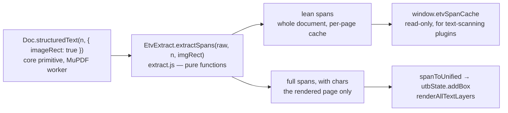

# SVG Text Layer — `svg-renderer.js` + `unified-text-box.js`

All text on the page — extracted PDF text, manually added boxes, and HarfBuzz recreations — is rendered as SVG `<text>` elements in a per-page `<svg class="text-layer">` that sits directly over the page image. There is one data model and one renderer for every kind of box.

Two baseline plugins share the work, and both run entirely in the page:

| Plugin | Files (`web/plugins/<plugin>/`) | Role |
|--------|-------|------|
| `text_tool` | `unified-text-box.js`, `svg-renderer.js`, `drag-resize.js`, `inline-edit.js`, `micro-typo.js` | The data model, the SVG layer, every interaction |
| `embedded_text_viewer` | `extract.js`, `etv-fetch.js` | Reads the PDF's embedded text and feeds it in as boxes |

---

## Data Model: `UnifiedTextBox`

Every piece of text is stored as a `UnifiedTextBox` instance inside the global `utbState.boxes` array. There are no separate state objects per box type.

```js
{
  id: string,           // stable, e.g. "utb-42"
  type: 'embedded' | 'redaction' | 'harfbuzz' | …,   // plugins may contribute further types
  page: number,
  text: string,
  lineId: string|null,  // groups spans on the same horizontal text line

  // Spatial — document pixel space (816×1056 base)
  x, y, w, h: float,

  // Typography
  fontFamily: string,   // a catalogue family, e.g. "Times New Roman"
  sizePt: float,        // font size in POINTS — the single canonical unit
                        // (converted to px once, at SVG render time)
  bold, italic, underline, strikethrough: bool,
  letterSpacing: float, // em
  color: string|null,   // null = per-type default color
  renderFont: string|null,    // optional render-face override; null = fontFamily

  // Kerning and word spacing
  kerning: bool,              // the EFFECTIVE value every reader uses
  kerningAuto: bool,          // true = nobody chose yet; the page decides (see text-tool.md)
  defaultSpaceWidth: bool,    // true = use native font spacing
  spaceWidth: float|null,     // manual override (applies when defaultSpaceWidth is false)
  nativeSpaceWidth: float|null, // cached HarfBuzz natural space advance

  // Per-character positioning (from PDF extraction or a plugin's measurement)
  baseCharPositions: [{c, x, w}]|null,
  baseFace: {fontFamily, bold, italic, sizePt, letterSpacing},  // the typography they were measured under

  // Micro-typography overrides (index → delta px)
  charAdvances: {},

  // Layout
  autoWidth: bool,      // true = box.w follows the rendered text; no resize handles

  // Redaction-only
  widths: {},           // candidate word → pixel width map
  labelText: string,
  tolerance: float,
  manualLabel: bool,
  uppercase: bool,
  nameSettings, candidates: object|null,   // filled by whichever plugin owns matching; null when none is installed
}
```

`baseCharPositions` apply only while the box is still set in `baseFace` and in the page's own kerning — `utbCharsValid(box)` is the single test; see [Settings and measured positions](text-tool.md#settings-and-measured-positions).

### Global state

```js
utbState = {
  boxes: [],           // UnifiedTextBox[]
  selectedId: null,
  microTypoId: null,
  microTypoCharIdx: null,
  editingId: null,     // id of box in inline-text-edit mode
  // addBox / getBox / removeBox / updateBox / getPageBoxes / reset
}
```

The core resets it (`utbState.reset()`, behind a `typeof` guard) whenever a document comes on screen.

---

## SVG Layer Architecture

### Coordinate system

Each page gets one `<svg class="text-layer" data-page="N" viewBox="0 0 816 1056">` absolutely positioned over the page image. The `viewBox` is the document's pixel space — `state.pageWidth` × `state.pageHeight`, 816 × 1056 for every PDF — and never changes while the document is open. Zoom is applied solely through CSS sizing of the SVG element itself.

This means **all box coordinates are always in document pixel space** — no zoom division or scale math anywhere in the rendering code.

### DOM structure per page

```
.page-container
  img#pageN                  ← page raster (a blob: URL from Doc.pageImageURL)
  svg.text-layer[data-page]  ← text overlay (same dimensions, absolute)
    g.utb-group[data-id][data-type]
      rect.utb-bbox          ← bounding box outline (visible when selected)
      text.utb-text          ← the actual SVG text element
      image.utb-pixel        ← only when a pixel renderer supplied a raster (see below)
      rect.utb-edge-l        ← left resize handle  (4px, transparent) — redaction boxes only
      rect.utb-edge-r        ← right resize handle (4px, transparent) — redaction boxes only
      g.utb-space-label      ← numeric space-width badges, when switched on
```

### Type colors

| Type | Text fill | Bbox stroke |
|------|-----------|-------------|
| `embedded` | `rgba(0, 100, 255, 0.82)` — blue | blue |
| `redaction` | `rgba(129, 201, 149, 0.90)` — green | green |
| `harfbuzz` | `rgba(255, 140, 0, 0.80)` — orange | orange |
| `ocr` | `rgba(0, 200, 255, 0.70)` — cyan | cyan |

`ocr` is the type reserved for text lines an analysis plugin read from the page's pixels; no baseline plugin creates such a box. Any other type draws in a neutral fallback color.

Fill is applied as `text.style.fill` (inline style) so it takes priority over the CSS stylesheet. A custom `box.color` value overrides the type default.

---

## Rendering Pipeline

### `renderBox(box)`

The core function. Creates or updates the `<g>` group and its children for a single box. Call this whenever any box property changes (position, text, font, `charAdvances`, etc.).

1. Finds or creates `<svg class="text-layer">` for the page (`getOrCreateSVGLayer`).
2. Finds or creates `<g data-id="...">`.
3. Updates the `<text>` element (see below). A box whose kerning nobody chose yet (`kerningAuto`) first asks the guarded seam `window.utbAutoKerning?.(box)`. Afterwards the optional pixel-renderer seam is asked (`window.utbPixelRender?.(box, xs, baseline)`, see [Unified Text Box](../architecture/unified-text-box.md)); a returned raster is shown as `<image class="utb-pixel">` and the group gets `.utb-pixel-mode`, which hides the `<text>`. No baseline plugin defines either seam; without them the SVG text renders as is.
4. Auto-fits `box.w` for `autoWidth` boxes (from the seam's `advanceW` when a raster was returned, else the measured text length; never below 6 px).
5. Updates the bbox rect (`x`, `y`, `width`, `height`, `stroke`).
6. Recreates the two edge handle rects — for `redaction` boxes only; text boxes size to their content.
7. Redraws the space-width badges when they are switched on (`setShowSpaceWidthLabels`).

### `<text>` attribute layout

```js
text.setAttribute('y', computeBaseline(box));       // box.y + box.h * 0.85 − 1.3
text.setAttribute('font-size',   GEO.docPtToPx(box.sizePt));  // pt → px (only here)
text.setAttribute('font-family', `"${box.fontFamily}"`);      // drawn from fonts.js's @font-face rules
text.style.fontKerning = box.kerning ? 'normal' : 'none';
text.setAttribute('x', xs.join(' '));               // one value per character
text.textContent = box.text;
```

Because `fonts.js` injects an `@font-face` rule for every installed catalogue face, the family named here is drawn from the same file `shaping.js` measures with.

**Per-character x positions** come from `computeXPositions(box)`:

```js
// When the measured positions apply — utbCharsValid(box):
cumulativeDelta += charAdvances[i] || 0
xs[i] = box.x + baseCharPositions[i].x + cumulativeDelta + spaceAdjust
// after a space, with a manual space width:  spaceAdjust += box.spaceWidth − nativeSpaceW

// Fallback (no per-char data, or it belongs to another typography):
xs = [box.x]
```

The cumulative delta means nudging character `i` shifts characters `i`, `i+1`, `i+2`, … by the same amount — which is the correct typographic behavior (shifting a glyph also shifts everything to its right). With a single x the browser lays the text itself, and a manual space width is applied through the SVG `word-spacing` attribute instead.

### `renderTextLayer(pageContainer, pageNum)`

Clears the `<g>` groups in the SVG layer and re-renders every box on that page. The group of a box in a live inline-edit or micro-typo session is kept — it carries the session's DOM — and only updated. The selection is restored afterwards from `utbState.selectedId`. `svg-renderer.js` subscribes this to the core's `page:rendered` PDFHooks event (emitted by `pdf-viewer.js` in `goToPage`), so the core never calls it by name.

### `renderAllTextLayers()`

Calls `renderTextLayer` for every currently-rendered page. Called after a page's spans were hydrated and after a document was announced.

---

## Selection

```js
selectBoxInSVG(id)    // adds .selected to matching .utb-group(s), removes from others
deselectAllInSVG()    // clears all .selected
```

The `.selected` class on `.utb-group` makes `.utb-bbox` visible (CSS `visibility: visible`) and changes stroke style. Edge handles are always present on `redaction` boxes but only styled to show a resize cursor on hover. Both calls also refresh the ruler marker (`window.refreshRuler?.()`).

---

## Embedded Text Ingestion

Embedded text is extracted **in the browser** by the `embedded_text_viewer` plugin. The core contributes one primitive — `Doc.structuredText(n)`, the page's raw MuPDF structured text in PyMuPDF's "rawdict" shape — and runs no analysis; turning that into spans is the plugin's own pass.



### From structured text to spans — `extract.js`

`EtvExtract.extractSpans(raw, pageNum, imgRect)` is a set of pure functions with no DOM and no document service in them ([span schema](../api-reference/api-reference.md#etvextract--embedded-text-spans-embedded_text_viewer)):

1. **Points → image pixels.** `imgRect` is where the page image sits on the page, in PDF points (`Doc.pageImageRect`, delivered in the same call as `raw.imageRect`). Every coordinate is scaled by `816 / imgRect width` and `1056 / imgRect height` — the viewer's page space, not the raster's own resolution, so overlays land correctly whatever the scan's DPI. A page with no embedded raster is shown as a render of the full page, so the page rectangle (`raw.rect`) is the placement. Spans below the 1056 px crop boundary are dropped.
2. **Merge.** Adjacent raw spans on a line that share font, flags and color (sizes within 1 pt) and lie closer than 1.5 em are one run; PDFs often split a visual run into many tiny spans.
3. **Split.** A run is cut into groups at a tab, at a space followed by a gap wider than 0.4 em, at a run of spaces, and after a character followed by an invisible gap wider than 0.5 em. Each group becomes one span.
4. **Restore spaces.** A gap between 0.15 em and 0.5 em after a character is a space MuPDF did not report; it is inserted as its own `chars` entry.
5. **Size.** `sizePt` is the span's bbox height over the face's (ascender − descender). MuPDF's own `size` is the text matrix expansion, which a text layer's per-word horizontal scaling inflates word by word; the vertical extent is unaffected by it.
6. **Lines.** Spans are sorted by `y` and numbered into `lineId`s by vertical proximity (3 px). `blockW` records the width each span must fill under justification.

Numbers are rounded the way Python's `round()` rounds — on the exact binary value, ties to even (`EtvExtract.pyRound`). `tests/spans.test.mjs` runs `extract.js` in Node over every recorded page and requires the spans, full and lean, to equal the recorded outputs in `tests/golden/` to within 1e-6.

### Two tiers — `etv-fetch.js`

`etv-fetch.js` subscribes to the core's `document:loaded` and `page:rendered` PDFHooks events. Extraction is **two-tier** so document size never dictates memory:

1. A background loop (`utbFetchSpans`) walks the whole document on a fixed chunk grid — pages 1–12 first for quick coverage of the opening pages, then 100 pages at a time. Each page is one `await Doc.structuredText(p, { imageRect: true })`, so a long scan yields to the UI between pages, and text requests queue behind a page the viewer wants to show. The spans are reduced to **lean** spans (`EtvExtract.leanSpan`: `page, text, x, y, w, h, sizePt, font` — no per-character data, about a tenth of the size) and kept in a per-page cache of JSON strings, exposed read-only to other plugins as `window.etvSpanCache` (`complete()`, `anyText()`, `hasPage(p)`, `isHydrated(p)`, `spansFor(p)`) — for any plugin that scans the whole document's text.
2. When a page is **rendered**, its FULL spans (with `chars`) are extracted (`etvFetchFull`) and hydrated into `UnifiedTextBox`es. Boxes therefore exist only for pages the user has visited.

The cache belongs to one document: it is keyed by `state.docHash`, every batch checks the hash before and after its `await`s, and a batch that finishes after another document was opened is discarded. The initial page renders before `document:loaded` arrives, when the cache is not yet valid; the `document:loaded` handler hydrates whatever is on screen.

Within each batch (`etvNormalize`):

1. **Font size normalization**: works directly on the canonical `span.sizePt` (points). The median `sizePt` of the first non-empty batch becomes the document's base size; any span within ±1pt of it is snapped to that value, otherwise it rounds to the nearest whole point — every later batch reuses the same base, so all batches agree. (The normalized value is written back to `span.sizePt`, which is what `spanToUnified` reads.)
2. Once per document, the batch's most used face is submitted as the toolbar default — `FontCatalog.select(face, undefined, 'layer')`, a claim a measured face outranks — and the same size and face normalization is applied to existing redaction boxes.

On hydration, each span is converted via `spanToUnified(span)` — font name mapped to a catalogue family by `normUtbFont`, bold and italic from the name and the flag bits — and added with `utbState.addBox(...)` (the `hydrated` page set prevents double-adds on page revisits). Then `renderAllTextLayers()` runs, `utbConnectRedactionsToLines()` links redaction boxes to their overlapping text lines, and `calculateAllWidths()` is called behind a `typeof` guard — no baseline plugin defines it.

---

## Line Grouping (`lineId`)

The `lineId` field groups all boxes that belong to the same horizontal line of text. It drives two behaviors:

- **Grouped vertical drag** (`drag-resize.js`): dragging any box vertically moves all boxes sharing its `lineId` and `page` by the same `dy`. Linked redaction boxes also follow.
- **Redaction snapping** (`utbConnectRedactionsToLines`): when a redaction's bounding box overlaps a text line by at least half the shorter of the two heights, the redaction inherits that line's `lineId`, `y`, `h`, and its typography (`fontFamily`, `sizePt`, `bold`, `italic`) — so anything measuring text against the bar measures in the page's own font. The row's best source wins: an `ocr` line the reader **certified with letters** (`box.ocr.trusted`: one letter at ±2 or better, three on a looser rung — its size is measured from the glyphs, whereas a scanned document's text layer only approximates it; a row of dots certified at ±10 says nothing about a face), else the `embedded` span, else — for a row whose only line is a failed read (a tolerant rung, an unread `□` band) — the reader's line lends its rows but the typography is the text around the bar: the adjacent embedded line with letters (the row above or below, within one and a half of its own height), else the layer's body face (`_utbFetchState.baseFont` at `bodyPt`: the layer's most used font at that font's own modal size by characters — also claimed to the font catalogue as the `layer` default; the median span size, `basePt`, only snaps sizes). A bar moves up to a better source when one lands: the reader's boxes precede the layer's spans on one path and follow them on the other. On EFTA00173953 the reader certifies nothing with letters; every bar there is Times New Roman 11 pt from the layer, not Arial bold or Courier from a read at ±10, and not the 8 pt the small print makes the page's median. The redaction is marked `uppercase` when a known candidate name (`state.candidates`, present only when a plugin supplies it) appears **in capitals** on that line, as written.

When it is done the function emits the generic `redactions:connected` event, so line-aware plugins can react without being named.

`window._utbFindNearestLine(pageNum, y, thresholdMultiplier = 2.0)` returns the nearest text-line box on a **shown** layer — a new box takes its face and size from what the user sees, never from a hidden line. The Add Box tool uses it ([Toolbar & Text Tool](text-tool.md#placing-new-boxes)).

---

## Interaction Modes

The text layer supports three mutually exclusive interaction modes on a selected span:

| Mode | Trigger | `utbState` field | Available for |
|------|---------|-----------------|---------------|
| **Selection** (default) | Single-click a span | `selectedId` | All types |
| **Inline Text Edit** | Double-click a span | `editingId` | Every type except `redaction` |
| **Micro-Typography Nudge** | Nudge button in toolbar | `microTypoId` | Spans whose `baseCharPositions` still apply (`utbCharsValid`) |

Entering one mode automatically exits the other. Escape exits whichever mode is active.

Drag and resize are SVG-native (`drag-resize.js`): one delegated `mousedown` listener on the document, deltas computed in SVG space through `getScreenCTM().inverse()` — no zoom division. Dragging moves the box horizontally and its whole line vertically; the edge handles of a `redaction` box resize it.

---

## Inline Text Editing — `inline-edit.js`

Double-clicking a span enters inline text edit mode. `redaction` spans are excluded by an explicit type guard — their label is machine-written by whichever plugin owns the box, so it is not typed by hand.

> **If no plugin owns that type,** a `redaction` box has nothing writing its label and cannot be hand-edited either. That combination is inert rather than harmful — the box still draws, drags, and resizes — but it means the Add Box tool is only fully useful with an analysis plugin installed. See [Optional Plugins](../plugins/).

1. `enterInlineEdit(box)`:
   - Guards: not a `redaction`. Exits micro-typo if active and commits any edit already open.
   - Sets `utbState.editingId = box.id`.
   - Adds `.editing` class to the `<g>` group (dashed blue glow on bbox).
   - Hides the SVG `<text>` element.
   - Inserts a `<foreignObject>` over the bounding box (wider than the box, so text can grow), containing an `<input type="text">` pre-filled with `box.text`.
   - The input is styled WYSIWYG: matching `fontFamily`, font size (`GEO.docPtToPx(box.sizePt)`), `color`, `fontWeight`, `fontStyle`.
   - Auto-focuses and selects all text.

2. **Committing** (`commitInlineEdit()`):
   - Reads the input value → `box.text = value`.
   - Removes the `<foreignObject>`, unhides the `<text>`.
   - When the text actually changed, the extracted per-character positions belong to the old text: `baseCharPositions` and `charAdvances` are dropped and the box becomes `autoWidth`.
   - Re-renders via `renderBox(box)`. An edit that only prepended characters keeps the right edge fixed, so the box grows leftward.
   - Clears `utbState.editingId`.

3. **Cancelling** (`cancelInlineEdit()`):
   - Same cleanup but discards changes (original text preserved).

4. **Event bindings**:
   - `Enter` → commit.
   - `Escape` → cancel.
   - `blur` (click-away) → commit.
   - `mousedown` / `click` on the `<foreignObject>` are stopped from bubbling to prevent drag-resize from intercepting.

---

## Micro-Typography Mode — `micro-typo.js`

Clicking the **Nudge** button (`#fabric-nudge-mode`) in the toolbar enters micro-typography mode for the selected box (requires valid `baseCharPositions`).

1. `enterMicroTypo(box)`:
   - Guards: `utbCharsValid(box)`, and `editingId` must be null.
   - Adds `.micro-typo` class to the `<g>` group.
   - Creates one invisible `<rect class="utb-char-hit" data-char-idx="N">` per character, sized to that character's advance width.
2. Clicking a hit rect opens a nudge popover with a slider (−20 to +20 px, step 0.1).
3. `applyNudge(box, charIdx, delta)`:
   - Writes `box.charAdvances[charIdx] = delta`.
   - Recomputes x positions via `computeXPositions(box)`.
   - Updates the SVG `<text>` element with a single `setAttribute('x', ...)` call — no DOM reflow.
   - Repositions all hit rects to match.
4. **Escape** closes the popover (first press) or exits micro-typo mode (second press).
5. Clicking the Nudge button again also exits the mode.

The nudge popover is an absolutely-positioned `<div class="utb-nudge-popover">` placed relative to the `.page-container` element.
