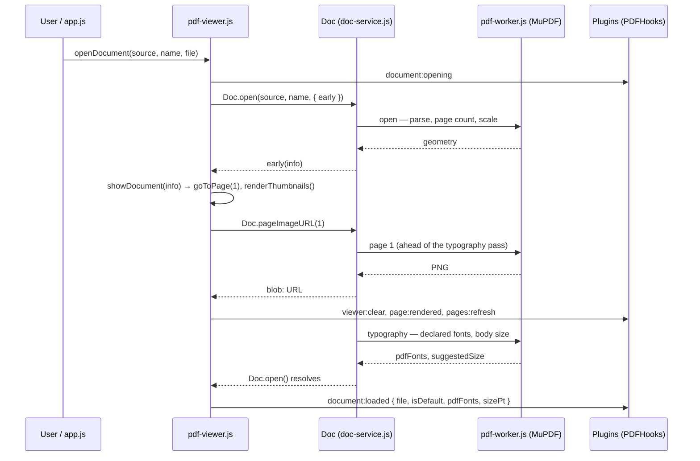

# PDF Viewer — `pdf-viewer.js`

`web/core/pdf-viewer.js` opens documents and renders pages. It does **not** use PDF.js — each page is an `` whose source is the page's raster, handed out on demand by the document service as a `blob:` URL (`Doc.pageImageURL(n)`). Opening a document yields metadata only, so a two-thousand-page document opens as fast as a two-page one, and the browser only ever holds the pages it shows.

The raster is the page's embedded scan — its own pixels, cropped to the 8.5 × 11 ratio — or a 96-DPI render when the page has none. Either way it lies in the one pixel space every coordinate in Recto uses. The document itself never leaves the browser: `Doc` hands the bytes to a MuPDF worker in the same page ([`Doc` reference](../api-reference/api-reference.md#doc--the-document-service)).

The viewer injects **no overlays of any kind**. Once the pages are on screen it emits `document:loaded`
and stops; plugins put their own content on the page from there. A box-creating plugin's boxes
arrive this way, not from the viewer.

## Functions

### `openDocument(source, name, file)`

The one way a document comes on screen — used by the file input, by drag-and-drop and by the startup load.

1. Emits `document:opening` `{ file, name, isDefault }` and awaits the handlers. `state` still describes the previous document at this point, which makes it the place for a plugin to reset per-document state.
2. Calls `Doc.open(source, name, { early })`. The `early` callback runs `showDocument(info)` as soon as the document service knows the page geometry — page 1 shows while the typography pass (declared fonts, sampled body size) is still running behind it.
3. Awaits that `showDocument` (or runs it now, with the final result, when `early` never fired — an image document).
4. Calls `announceDocument(data, file)`, which emits `document:loaded`.

`file` is the user's `File`, or `null` for the startup document; `isDefault` is `!file`. Between `document:opening` and `document:loaded` the viewer already shows the new document's pages, so a plugin sees `page:rendered` for the new document **before** its `document:loaded`.

### `showDocument(info)`

Takes `Doc.open()`'s result, or its early form:

1. Resets the text boxes of the previous document (`utbState.reset()`, `clearAllSVGLayers()` — both behind `typeof` guards, so the core runs without `text_tool`)
2. Stores `state.numPages`, `state.pageWidth`, `state.pageHeight` and `state.docHash` (the file's SHA-256), and resets the page counter
3. Navigates to page 1 — which asks for just that page's raster
4. Renders thumbnails — each one asks for its 180 px raster only when it scrolls into view

Page rasters are not part of `info`. Whoever shows a page — the viewer, a thumbnail, a plugin reading pixels — asks `Doc.pageImageURL(n)` at that moment. The URLs are kept in a small LRU and an evicted URL is revoked, so they are never stored.

### `announceDocument(info, file)`

Emits `document:loaded` with `{ file, isDefault, pdfFonts, sizePt }` and awaits the handlers. `pdfFonts` are the document's declared BaseFont names, most used first, and `sizePt` its sampled body size (12 when unknown) — the facts a typography plugin turns into a default face and size. The core keeps no font list of its own.

That is the whole sequence. The viewer creates no boxes and calculates no widths of its own;
anything that appears on top of the page was put there by a plugin subscribing to
`document:loaded` or `page:rendered`.

`loadDocument(info, file)` runs `showDocument` and `announceDocument` back to back, for a caller that already holds `Doc.open()`'s result.

### `handleFileUpload()`

Triggered when a file is selected or dropped (`app.js` accepts PDFs and PNG, JPEG, TIFF, BMP, WebP images). Sets `state.currentFile`, `state.hasPdf` (is it a `.pdf`) and the title, shows the loader in `#viewer-placeholder`, and calls `openDocument(file, file.name, file)`. A failure is shown in `#placeholder-text`.

### The startup document

`app.js` reads `generated/default-document.json` (written by the build: the PDF directly in `web/assets/pdfs/`), fetches the file and calls `openDocument(blob, name, null)`. It does so only after `ui:ready` and `DOMContentLoaded`: plugin scripts in `scripts_after_app` subscribe to `document:loaded` when they parse, and a document opened before they had would announce itself to nobody.

### `goToPage(pageNum)`

Switches the viewer to display a specific page:

1. Awaits `Doc.pageImageURL(pageNum)` **first**, so the page enters the DOM with its image and a plugin reading `#page<n>` finds pixels. A later `goToPage()`, or another document, overtakes a call that is still waiting
2. Emits `viewer:clear` (plugins tear down per-page state — e.g. `webgl_mask` disposes GL contexts)
3. Creates a new `page-container` div (`#pageContainer<n>`) with CSS custom properties for dimensions
4. Inserts an `">` with that URL and appends the container to the viewer
5. Emits `page:rendered` `{ pageContainer, pageNum }` — plugins draw their overlays (the `webgl_mask` mask canvas, the `text_tool` SVG text layer). **The core itself creates no overlay DOM.**
6. Emits `pages:refresh` so per-page overlays re-sync

### Text overlays

The viewer injects no box DOM. All boxes — embedded text, HarfBuzz recreations, and manually added boxes — are rendered as SVG `<text>`/`<g>` elements in a per-page `svg.text-layer`, owned by `text_tool` ([SVG Text Layer](embedded-text-viewer.md)). `svg-renderer.js` builds that layer in response to the `page:rendered` event; drag, resize, selection, and inline editing are handled SVG-natively in `drag-resize.js`, `inline-edit.js`, and `micro-typo.js` (all under `web/plugins/text_tool/`).

---

## Unified Options Bar

The viewer features a centralized options row (`#unified-options-bar-container`), into which the build inlines every plugin's `ribbon_bar` and `options_bar` fragment. `text_tool`'s formatting bar in it is shared by every plugin that puts text on the page.

Settings modified in this bar (Font, Size, Kerning, etc.) are applied to the currently selected box, whatever kind of box it is.

## Add Box to Line Tool

`text_tool` contributes a manual box tool, accessible via the `add_box` icon (`#tool-add-box`) in its Insert group.

**How it works:**
1. Click the tool to activate `state.activeTool = 'add-box'`.
2. Click anywhere on the PDF page. `app.js` maps the click to document pixel space through the SVG text layer's `getScreenCTM()` and calls `handleManualAddBox(pageNum, x, y)`.
3. `window._utbFindNearestLine()` (from `embedded_text_viewer`) searches for a text line within 2x height proximity.
4. If a line is found, the new box inherits that line's `y`, `height`, `lineId`, font and size.
5. If no line is found, a default box is created at the click location.

> **Note:** the box it creates carries `type: 'redaction'`. The type name is load-bearing in
> `text_tool`'s styling and snapping code; see [Unified Text Box](../architecture/unified-text-box.md).
