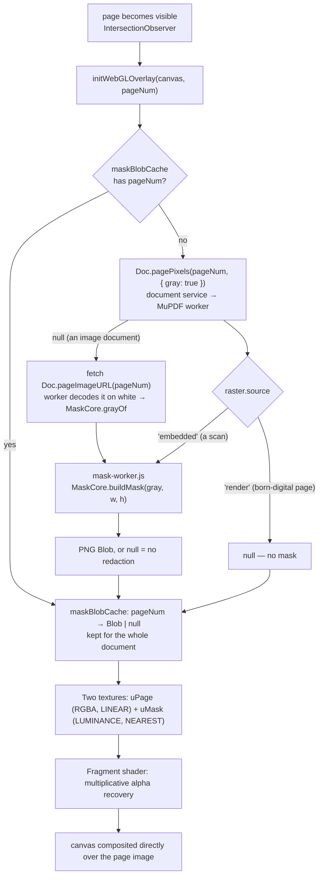

# WebGL Mask — `webgl-mask.js`

`web/plugins/webgl_mask/webgl-mask.js` renders GPU-accelerated mask overlays over blacked-out page regions. The masks themselves are detected in the browser too — by the plugin's own worker (`mask-worker.js` running `mask-core.js`), from the very pixels the viewer shows.

| File (`web/plugins/webgl_mask/`) | Role |
|------|------|
| `plugin.json` | Declares the toolbar button, the options bar, `webgl-mask.css`, and `webgl-mask.js` in `scripts_before_viewer` |
| `webgl-mask.js` | Overlay canvases, WebGL setup, mask cache, toolbar wiring |
| `mask-worker.js` | The plugin's worker: gray pixels in, mask PNG out |
| `mask-core.js` | `MaskCore.buildMask` — the detection, pure loops with no DOM |

## Integration — fully hook-driven

`webgl-mask.js` is a self-contained plugin: it touches the core only through the [`PDFHooks`](../api-reference/api-reference.md#pdfhooks-events) bus and the document service (`Doc.pagePixels`), and owns its own DOM. Deleting the `web/plugins/webgl_mask/` folder removes every webgl reference from the running app.

| PDFHooks event | Handler does |
|----------------|--------------|
| `ui:ready` | wires the `#toggle-webgl` button + `#edge-subtract` slider; calls `registerSubtoolbar(toggleBtn)` |
| `page:rendered` | **creates** the `.webgl-overlay` `<canvas>` for that page and appends it (the core owns no overlay DOM), then `setupWebGLOverlay(...)` |
| `pages:refresh` | `refreshWebGLCanvases()` |
| `viewer:clear` | `clearWebGLContexts()` |

There is no `document:loaded` work: a mask is built when a page's overlay
initializes, and the blob cache invalidates itself the moment `state.docHash` changes.

## Architecture



Nothing is fetched and nothing leaves the browser: the page's pixels come from the document service, the detection runs in the plugin's worker, and the result is cached in `maskBlobCache` (a `null` entry remembers "no mask here", so page revisits skip the detection entirely). The cache is owned by the document identified by `maskCacheHash` and is validated against `state.docHash` on every use — a page overlay can initialize before any document-change event lands in the plugin. A mask that finishes after another document was opened is dropped.

**Only pages whose raster is the embedded scan get a mask.** A born-digital page, shown as a 96-DPI render, carries no scan to analyse, so `buildPageMask` answers `null` without starting the worker. An image document is its own scan: `Doc.pagePixels` answers `null` for it, so the plugin fetches `Doc.pageImageURL(n)` and hands the blob to its worker, which decodes it over white (a transparent pixel shows the page behind it, it is not black) and takes its gray with `MaskCore.grayOf`.

## The mask — `mask-core.js`

`MaskCore.buildMask(gray, width, height)` takes one byte per pixel and returns a gray mask of the same size, or `null` when the page has no blacked-out region:

| Mask value | Meaning |
|------------|---------|
| `255` | Inside a blacked-out region — nothing to recover, the shader shows white |
| `0` | Clear page |
| `255 · (1 − t)` | On a box's rim, where the page shows through the box as `page × t`; the shader divides `t` out again, so text under the rim comes back with the paper |

It has two halves, all written out as plain loops — no image-processing library is involved.

### Detection — `MaskCore.regions` (the port of the server's)

1. **Threshold.** A pixel counts as black only when its gray value is `0`.
2. **Drop discs** (`removeDiscs`). Punched holes and bullet discs are black and solid too. A component is a disc when its bounding box is square within 2 px, 16–44 px across, and filled to about π/4 of the box (70–85 %).
3. **Open** with a 5 × 5 element (erode, then dilate; pixels outside the image never erode the edge). Thin text protrusions and hairlines disappear, solid blocks survive.
4. **Keep the solid external components** (`filterComponents`). Components are 8-connected; one lying inside another's hole is ignored. A component must be at least 17 × 10 px, and its `area / perimeter` — measured over its outer border, followed the way Suzuki's border-following algorithm does — must be at least 2: for a thin stroke that ratio is about half the thickness, for a block far more.
5. **No fill.** A region is the kept component's own pixels. What a component encloses stays page: where the bars of adjacent lines touch they form one component, and the white gaps between them — with the punctuation standing there — must not be masked. (The server filled them; no recorded page has such a gap, so the goldens are unaffected.)

### Edges — `MaskCore.transmission` (this plugin's own)

What the pages show (measured, see the migration notes): a redaction is a black rectangle with a soft rim of 1–3 pixels, all the way round, corners included. A rim pixel reads `page × t` with `t` constant along one side of one box. Boxes overlap into one region; where their rims cross, the `t` multiply (`bc · d3 / 255 = 9b`, to the digit); a box covers `ax · ay` of its own corner pixel. The boxes themselves cannot be told from the region's shape — but every straight stretch of its outline is a side of some box, and that is enough:

- **Sides.** The outline is cut into its straight sides (`sidesOf`). Outward of a side lie its *lines*, rows 1..3.
- **Levels.** The level of a line — what white paper reads under it — is its **brightest** pixel: text only ever darkens. A second pixel must vouch for it (within 6 %), and the two pixels at either end of a long side are left out (a corner's transition). A level nothing vouches for is no level: that rim stays as it is.
- **Pieces.** One side can belong to two boxes that end in the same pixel column (one with a faint rim, one with a dark two-line rim). A side is cut into pieces, the plateaus of its first line (≥ 6 px within 2 levels; a piece's level is the value most of its pixels hold). A plateau darker than the side's brightest could be a flat stroke of text under the rim, so it counts as a box's only when it reaches an end of the side — a corner of the outline — or runs longer than any stroke (20 px); under a dark rim text itself flattens into plateaus, and only length counts. And a rim gets lighter outward: a plateau whose next line is darker still is a stem standing against the box, not a rim.
- **Shared lines.** Lines read their level from pixels no other line or corner reaches. A line shared from end to end — a short step of the outline, a narrow gap between two boxes — waits, and takes what is left once the known levels are divided out (nearest lines first, longest sides first). One pixel is never evidence.
- **Corners.** Where a horizontal side ends and the region stops, the vertical side starting there is the same box's: the 3 × 3 corner block gets `1 − (1 − tx)(1 − ty)`.
- **Paint.** Every pixel's `t` is the product of the lines and corner blocks on it. A pixel darker than its line's level is text and keeps its darkness.

**Every rule errs toward text.** The only places where something darker than its line is declared paper (`t = 0`, shown white like the region) all lie under a rim that hides 7/8 of the page or more (`DARK`): a dip of at most 4 px where two stacked boxes overlap — at a row where the region's outline shows a box ending, confined to the rim, white right beyond it; the few pixels of the step between two pieces; the single pixel next to a convex corner, where the resampling rings; a corner pixel under two dark rims. What this costs and buys was measured on pages built from a real text page plus boxes with known rims laid at random over the text: against the server's two rings the rim residue drops by a factor of 10–40, text lost under light and medium rims stays level or drops, and under rims darker than 90 % it rises by some tens of pixels per page. Loosening any of the rules above (dips without outline evidence, a paper tolerance in the shader) was tried and cost two to ten times the text.

`tests/masks.test.mjs` runs the same `mask-core.js` in Node. The **regions** of every recorded page must equal the 255 pixels of the recorded masks in `tests/golden/` (one page differs by design: a scan taller than 8.5 × 11 is masked over the cropped raster the viewer shows, so its regions equal the recording's top rows). The **edges** are held to pages built in the test, where the truth is known: a rim comes off — sides, second line, corner blocks, the two pieces of a flush side — and ink under or beside it stays: strokes running into a rim, a flat bar under it, a stem standing against the box, ink on a one-pixel step.

### The worker — `mask-worker.js`

```
→ { type: 'init', core }                       the absolute, content-hashed URL of mask-core.js (importScripts)
→ { id, gray: Uint8Array, width, height }      one page's gray pixels (transferred)
← { id, png: Blob | null, ms }                 the mask as a lossless PNG; null = no redaction on the page
← { id, error }                                on failure — the overlay treats it as "no mask"
```

The worker is started on first use (`maskWorkerReady`) from `assetURL('plugins/webgl_mask/mask-worker.js')`; the URL of `mask-core.js` is made absolute before it is handed over, because a worker resolves relative URLs against its own script. The `samples` buffer `Doc.pagePixels` returned is transferred straight on to the worker — the pixels are never copied on the main thread.

The mask comes back as a PNG blob because that is what the overlay loads into its texture. Gray `v` is written as `(v, v, v, 255)`, so nothing is premultiplied away and the texture's red channel is the mask.

## Functions

### `setupWebGLOverlay(pageContainer, canvas, pageNum)`
Registers a page container with the `IntersectionObserver`. When a page becomes visible, `initWebGLOverlay(canvas, pageNum)` is called, which builds that page's mask on demand; a page that scrolls out of view has its context destroyed (`destroyWebGLOverlay`).

**Texture setup:**
- Page texture (`uPage`): `gl.RGBA`, `gl.LINEAR` filtering, uploaded from the page's `">` — the page stays in color
- Mask texture (`uMask`): `gl.LUMINANCE` (single-channel), `gl.NEAREST` filtering (preserves hard pixel boundaries)
- Wrapping: `gl.CLAMP_TO_EDGE`

The canvas takes the mask's pixel size (the scan's own resolution); `webgl-mask.css` stretches it over the page container like the image beneath it, and the inline `mix-blend-mode: normal` composites it directly over the page.

### `clearWebGLContexts()`
Destroys all active WebGL contexts (`WEBGL_lose_context`) and disconnects the observer. Subscribed to the `viewer:clear` event (fired before each page change).

### `updateWebGLUniforms(specificPage?)`
Reads `#edge-subtract` value `/ 255.0` → `uStrength` uniform and redraws. No texture re-upload needed — instant 60fps updates. (The slider element is looked up directly by the plugin; the core `els` cache does not hold it.)

### `refreshWebGLCanvases()`
For every page container on screen: initializes an overlay that has no context yet, otherwise redraws it and shows or hides the canvas according to the toggle.

## Shaders

### Vertex Shader
Draws a full-screen quad; maps clip-space coords to UV with Y-flip.

### Fragment Shader
```glsl
vec3 page = texture2D(uPage, vTexCoord).rgb;
float mask = texture2D(uMask, vTexCoord).r;
vec3 result;
if (mask > 0.999) {
  // Interior: fully covered, original unrecoverable — show white
  result = vec3(1.0);
} else {
  // Border/clear: invert anti-aliasing multiplication, per channel
  result = min(page / max(1.0 - mask, 0.001), 1.0);
}
result = mix(page, result, uStrength);   // Reveal Strength: a linear fade from the page as it is to the page revealed
gl_FragColor = vec4(result, 1.0);
```

**Three pixel cases:**

| Pixel type | `mask` | Behaviour |
|---|---|---|
| Interior | 1.0 | White, faded in by `uStrength` |
| Border | 0 < m < 1 | `page / (1 - mask)` — recovers original via division — faded in by `uStrength` |
| Clear | 0.0 | `page / 1.0` — passes through unchanged |

The multiplicative recovery correctly reverses anti-aliasing: dark text under a border pixel stays dark; a white background pixel is scaled back to white.

## UI Controls

| Control | ID | Effect |
|---------|-----|--------|
| WebGL toggle | `toggle-webgl` | Shows/hides all `.webgl-overlay` canvases and opens the plugin's options bar (`#webgl-options-bar`) through `openSubtoolbar` |
| Reveal strength | `edge-subtract` | 0–255 → `uStrength` uniform |

Both come from the plugin's own fragments (`toolbar_button.html`, `options_bar.html`), which the build inlines into the page.

## Context Limits

Browsers enforce ~16 simultaneous WebGL contexts. The lazy `IntersectionObserver` strategy ensures contexts are only allocated for pages with actual masked regions, preventing `CONTEXT_LOST_WEBGL` crashes on large documents.
